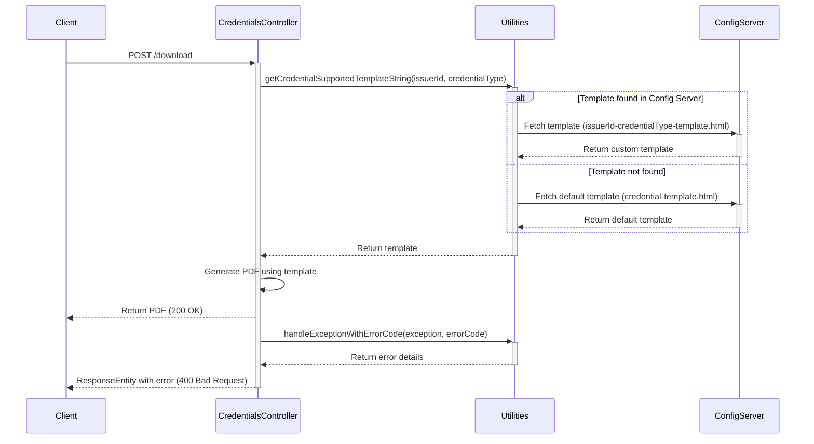

# Download Custom Credential Templates

## Overview
This feature provides option to download a Verifiable Credential (VC) as a PDF using custom templates.
The templates is fetched from a configuration server. Code first tries to find a template using the pattern `issuerId-credentialType-template.html`.
If this specific template is not found, it will use `credential-template.html`.

## Sequence Diagram

