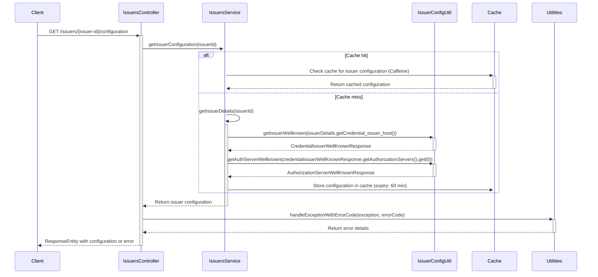

# Issuer Configuration Feature

## Overview

This feature provides an endpoint to retrieve the configuration of a credential issuer. The configuration is
fetched from the issuer's well-known endpoint and the authorization server's well-known endpoint. 
The results are cached using Caffeine to improve performance and reduce the load on the external services. This endpoint
is called in inji-web when the issuer is selected to retrieve its respective configurations

## Sequence Diagram

The following sequence diagram illustrates the flow of the `getIssuerConfiguration` method in the `IssuersController` class,
including interactions with the `IssuersService`, `IssuerConfigUtil`, `Utilities` and caching mechanisms.



## Configuration

### Cache Configuration

The caching mechanism used in this project is Caffeine. The cache timeout properties are defined in the `application-local.properties` file.

#### Cache Timeout Properties

- `cache.credential-issuer.wellknown.expiry-time-in-min`: Cache expiry time in minutes for the issuer's well-known endpoint response.
- `cache.issuers-config.expiry-time-in-min`: Cache expiry time in minutes for issuers configurations read from a config file.
- `cache.credential-issuer.authserver-wellknown.expiry-time-in-min`: Cache expiry time in minutes for the authentication server's well-known endpoint response.
- `cache.default.expiry-time-in-min`: Default cache expiry time in minutes for other cache types.

### Increasing Cache Time

To increase the cache time, you can modify the properties in the `application-local.properties` or
`mimoto-default.properties` file. For example, to set the cache expiry time to 120 minutes, update the properties as follows:

```properties
# Cache expiry time in minutes for the issuer's well-known endpoint response.
cache.credential-issuer.wellknown.expiry-time-in-min = 120
# Cache expiry time in minutes for issuers configurations read from a config file.
cache.issuers-config.expiry-time-in-min = 120
# Cache expiry time in minutes for the authentication server's well-known endpoint response.
cache.credential-issuer.authserver-wellknown.expiry-time-in-min = 120
# Default cache expiry time in minutes for other cache types.
cache.default.expiry-time-in-min = 120
```